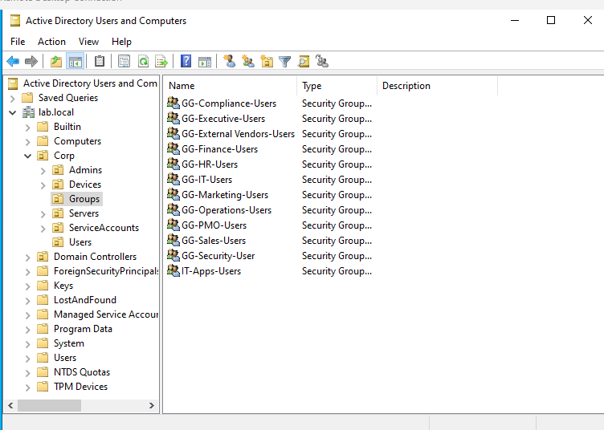
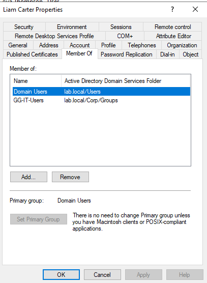
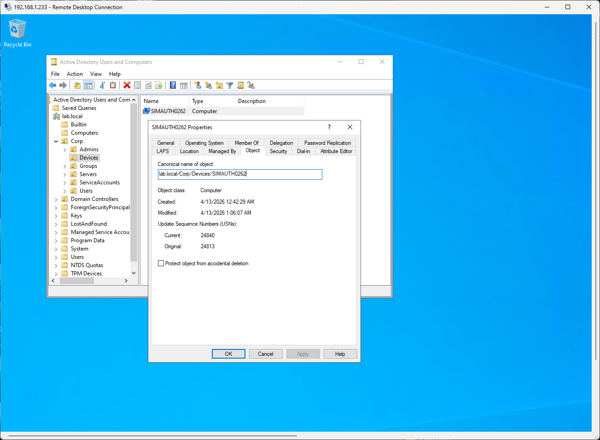
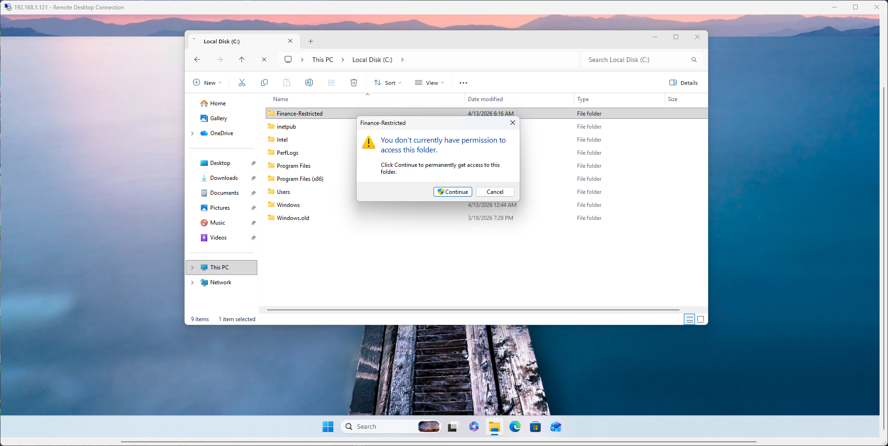
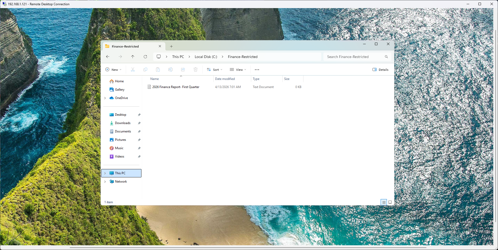
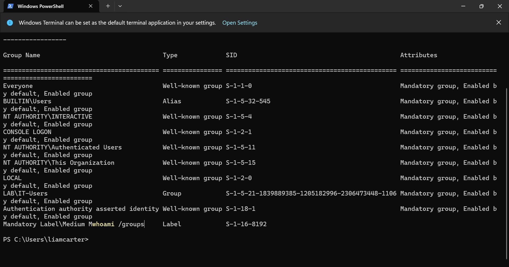

# iam-rbac-active-directory-lab
IAM RBAC lab demonstrating identity-to-access enforcement using Active Directory, security groups, and NTFS permissions
# 🔐 IAM RBAC Enforcement – Active Directory Lab

## 📌 Overview
Built a working Identity & Access Management (IAM) lab to simulate enterprise access control using Active Directory.

This project demonstrates how identity, group membership, and NTFS permissions work together to enforce **role-based access control (RBAC)**.

## Problem

Organizations often grant users excessive or unmanaged access, leading to:
- Privilege creep
- Unauthorized data exposure
- Lack of visibility into who can access sensitive resources

---

## Solution

Implemented Role-Based Access Control (RBAC) using Active Directory:

- Created security groups aligned to business roles (Finance, IT, HR, etc.)
- Assigned users to groups instead of direct permissions
- Structured Organizational Units (OUs) for device governance
- Applied NTFS permissions to enforce access restrictions
- Validated access behavior through real authentication testing

---

## Outcome

- Unauthorized users were denied access to restricted resources
- Authorized users successfully gained access after the correct group assignment
- Device placement ensured consistent policy enforcement
- Identity-based access control was validated end-to-end

---

## Security Impact

- Enforces **least privilege access**
- Reduces **attack surface and lateral movement risk**
- Improves **auditability and compliance readiness**
- Demonstrates **identity-driven access control model**

---

## 🧠 Objective
Implement and validate RBAC by ensuring:
- Users are assigned roles via security groups  
- Access to sensitive resources is restricted based on role  
- Authentication and authorization are properly separated  
- Access enforcement is verified through real testing  

---

## 🏗️ Environment
- Active Directory Domain Services (Windows Server 2022)  
- Domain: `lab.local`  
- Domain-joined client machines  
- OU structure aligned to identity governance  
- PowerShell used for user provisioning  

---

## 🧩 RBAC Model (Security Groups)



Created security groups aligned to business roles:
- GG-Finance-Users  
- GG-IT-Users  
- GG-HR-Users  
- GG-Operations-Users  
- GG-Marketing-Users  

✔ Groups represent **roles**, not individual users  
✔ Enables scalable and maintainable access control  

---

## 👤 User Role Assignment



Example:
- User: **Liam Carter**
- Assigned Role: **GG-IT-Users**

✔ Identity mapped to role through group membership  
✔ Follows RBAC best practices  

---

## 🖥️ Device Governance (OU Structure)



- Domain-joined device placed into:
  - `Corp/Devices`

✔ Aligns endpoints with governance structure  
✔ Supports future policy enforcement (GPO, Conditional Access, etc.)

---

## 🔐 Access Control Implementation

### Step 1: Remove Inherited Permissions
- Disabled NTFS inheritance on the sensitive folder  
- Removed overly broad groups:
  - `Users`
  - `Authenticated Users`

✔ Eliminated excessive default access  

---

### Step 2: Apply Role-Based Permissions
- Granted access only to:
  - `GG-Finance-Users`

✔ Enforced **least privilege access model**

---

## 🧪 Validation Testing

### ❌ Unauthorized Access (IT User)



- User: Liam Carter (`GG-IT-Users`)
- Attempted access to Finance-restricted folder  
- Result: **Access Denied**

✔ Access was denied despite successful authentication, confirming proper separation between authentication and authorization controls  

---

### ✅ Authorized Access (Finance Role)



- Finance user successfully accessed the restricted folder  

✔ Confirms RBAC is correctly enforced  

---

## 🔍 Identity Token Validation



Command used:
```powershell
whoami /groups

✔ Confirms user’s security token includes assigned group (GG-IT-Users)
✔ Validates identity → group → access flow

🧠 Key Takeaway

Access control is not just about provisioning users.

It requires:

Proper identity assignment
Role-based group mapping
Token validation
Enforcement at the resource level

Misconfigured permissions or DNS alone can break identity-based access control.

🔐 Security Impact
Enforced least privilege access
Prevented unauthorized data access
Reduced risk of privilege creep
Demonstrated audit-ready IAM control validation
##
